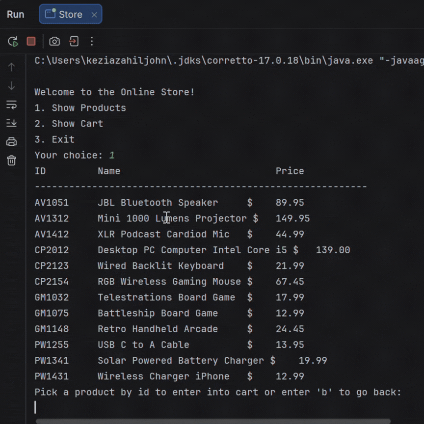

# Online Store

## Description of the Project

A program that acts like a store and allows users to view items and add it to cart and purchase it.

## User Stories

- As a user, I want to be able to view the inventory, so that I can pick items I want from it.
- As a user, I want to add items to the cart, so I can check them out and buy them.
- As a user, I want to be able to exit the cart or program at every step, so that I can step away from the purchase if I need to.

## Setup

Instructions on how to set up and run the project using IntelliJ IDEA.

### Prerequisites

- IntelliJ IDEA: Ensure you have IntelliJ IDEA installed, which you can download from [here](https://www.jetbrains.com/idea/download/).
- Java SDK: Make sure Java SDK is installed and configured in IntelliJ.

### Running the Application in IntelliJ

Follow these steps to get your application running within IntelliJ IDEA:

1. Open IntelliJ IDEA.
2. Select "Open" and navigate to the directory where you cloned or downloaded the project.
3. After the project opens, wait for IntelliJ to index the files and set up the project.
4. Find the main class with the `public static void main(String[] args)` method.
5. Right-click on the file and select 'Run 'YourMainClassName.main()'' to start the application.

## Technologies Used

- Java: Mention the version you are using.
- Any additional libraries or frameworks used in the project.

## Demo

Include screenshots or GIFs that show your application in action. Use tools like [Giphy Capture](https://giphy.com/apps/giphycapture) to record a GIF of your application.

## Future Work

Outline potential future enhancements or functionalities you might consider adding:

- Better UI.
- More functionality with payments.
- Better data storage.

## Resources

List resources such as tutorials, articles, or documentation that helped you during the project.

- [Java Programming Tutorial](https://www.example.com)
- [Effective Java](https://www.example.com)

## Thanks

- Thank you to Raymond for continuous support and guidance. 